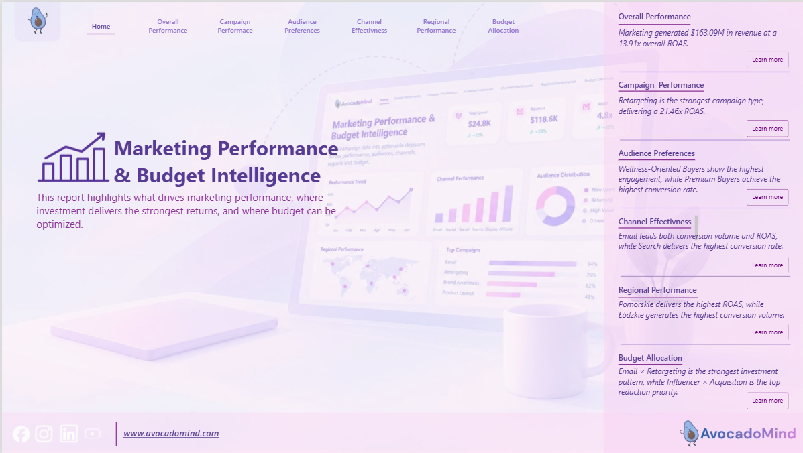
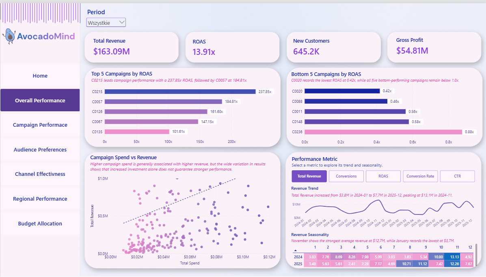
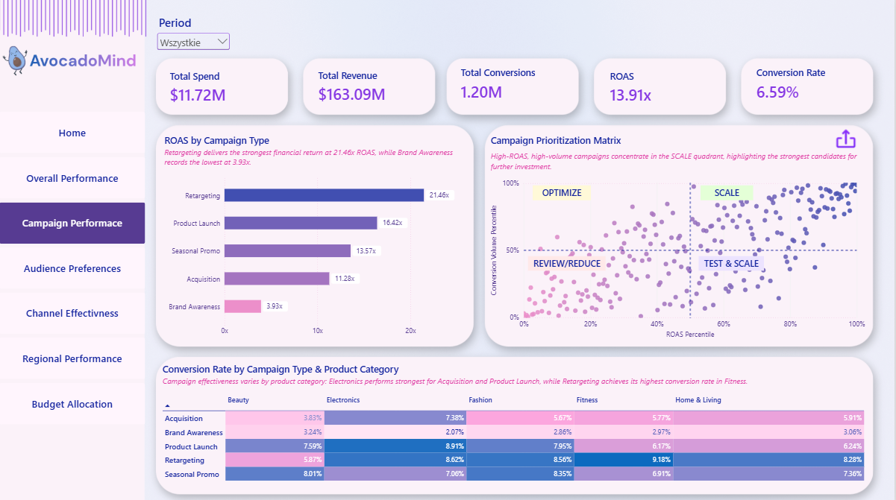
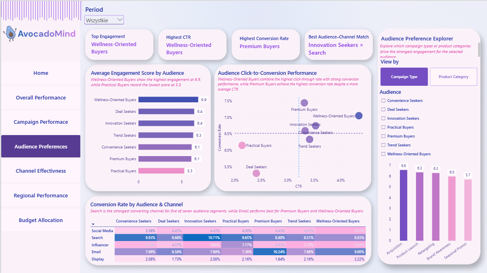
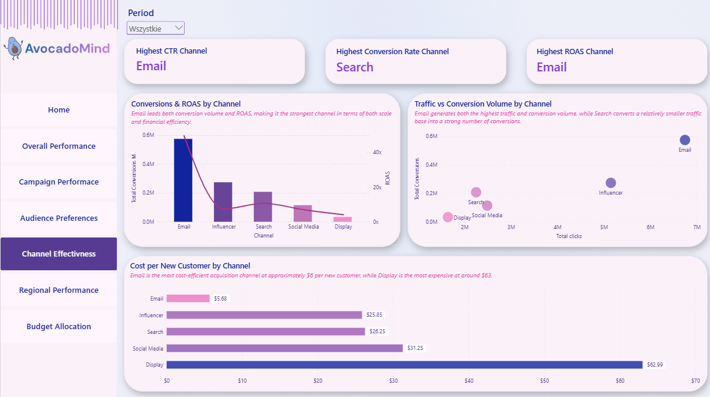
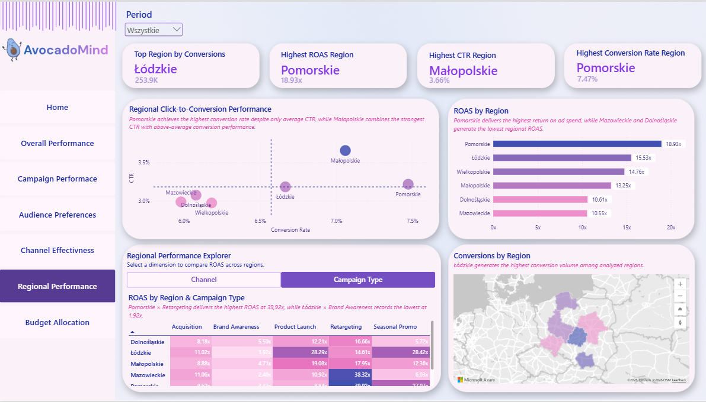
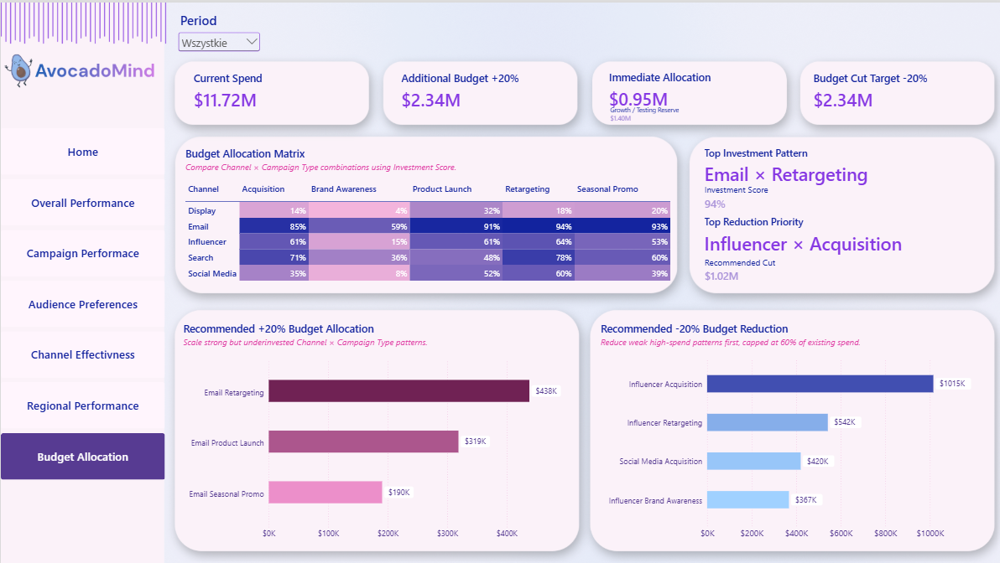
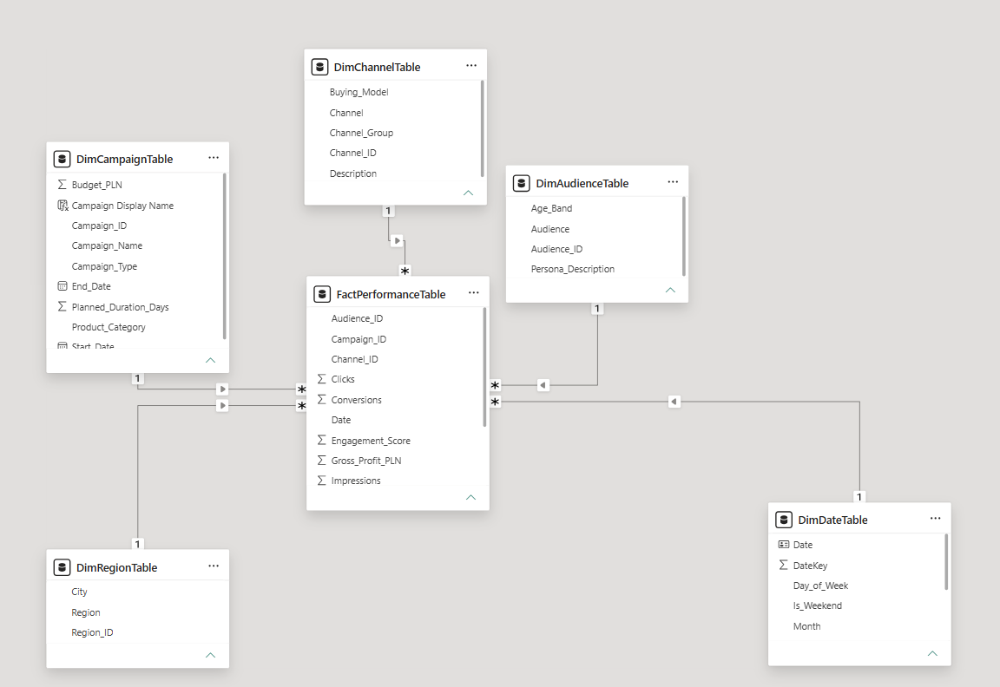

# AvocadoMind | Marketing Performance & Budget Intelligence

Power BI portfolio project focused on **marketing performance, audience behavior, channel effectiveness, regional performance, and data-driven budget optimization**.

The goal of the project is to move beyond descriptive reporting and turn campaign data into clear business decisions: **what drives performance, where investment generates the strongest returns, and where budget should be reallocated or reduced**.

> **Portfolio note:** the dataset used in this project is synthetic and was created for analytical and portfolio purposes. No confidential or company data is included.

### [▶ View the interactive Power BI report](https://app.powerbi.com/view?r=eyJrIjoiNTk1ZDQ2MTItYjQ5NS00Y2ViLWFjZTctMTYzZGY3MTVlNDE5IiwidCI6ImRlYjYzZTJiLTAzZTAtNDBlMC04OTUzLTM3YTkyMTYxNzc3YiJ9)

---

## Project overview

AvocadoMind is a fictional marketing organization running campaigns across multiple channels, campaign types, audiences, product categories, and Polish regions.

The report was designed to answer six core business questions:

1. How is marketing performing overall?
2. Which campaign types and individual campaigns generate the strongest results?
3. Which audience segments respond best to different marketing activities?
4. Which channels provide the best combination of scale, conversion efficiency, and return?
5. How does performance differ across regions?
6. How should the marketing budget be increased or reduced based on performance?

---

## Dashboard pages

### 1. Overall Performance
Executive overview of marketing results and performance trends.

Key elements include:
- Total Revenue
- ROAS
- New Customers
- Gross Profit
- Top and Bottom campaigns by ROAS
- Spend vs Revenue analysis
- Dynamic performance trend and seasonality analysis

### 2. Campaign Performance
Campaign-level analysis combining financial return and conversion performance.

The page includes:
- ROAS by Campaign Type
- Campaign Prioritization Matrix
- Campaign Type × Product Category conversion heatmap
- Campaign-level recommendations such as **SCALE**, **OPTIMIZE**, **TEST & SCALE**, and **REVIEW / REDUCE**

### 3. Audience Preferences
Analysis of how different audience segments engage and convert.

The page includes:
- Engagement Score by Audience
- CTR vs Conversion Rate analysis
- Audience × Channel conversion heatmap
- Dynamic Audience Preference Explorer
- Best audience–channel combinations

### 4. Channel Effectiveness
Comparison of channel performance from both scale and efficiency perspectives.

The page includes:
- Conversions and ROAS by Channel
- Traffic vs Conversion Volume
- Cost per New Customer
- Highest CTR, Conversion Rate, and ROAS channels

### 5. Regional Performance
Geographical analysis of marketing effectiveness across Polish regions.

The page includes:
- Conversion volume by Region
- ROAS by Region
- CTR vs Conversion Rate by Region
- Dynamic Region × Campaign Type / Channel performance explorer

### 6. Budget Allocation
Decision-support layer translating performance into budget recommendations.

The page includes:
- Investment Score matrix for Channel × Campaign Type combinations
- Top Investment Pattern
- Top Reduction Priority
- Recommended +20% budget allocation
- Recommended -20% budget reduction
- Growth / Testing Reserve

---

## Selected business insights

- Marketing generated **$163.09M in revenue** at an overall **13.91x ROAS**.
- **Retargeting** was the strongest campaign type, delivering approximately **21.46x ROAS**.
- **Email** led both conversion volume and ROAS, making it the strongest overall channel.
- **Search** achieved the highest conversion rate.
- **Pomorskie** delivered the highest regional ROAS at approximately **18.93x**.
- **Łódzkie** generated the highest conversion volume.
- **Email × Retargeting** ranked as the strongest investment pattern with a **94% Investment Score**.
- **Influencer × Acquisition** was identified as the highest-priority pattern for budget reduction.

---

## Budget optimization methodology

A dedicated **Investment Score** was created to compare Channel × Campaign Type combinations using percentile-based scoring.

The score combines:

| Component | Weight |
|---|---:|
| ROAS | 40% |
| Conversion Rate | 25% |
| Acquisition Efficiency | 20% |
| Conversion Volume | 15% |

### +20% budget scenario

The allocation logic does not simply assign the largest increase to the highest-scoring pattern.

Instead, it:
- identifies the strongest investment patterns,
- compares their target investment share with current budget share,
- prioritizes positive opportunity gaps,
- limits immediate scaling to a maximum of **+100% of existing spend per pattern**,
- keeps any unsupported amount as a **Growth / Testing Reserve**.

This resulted in approximately **$0.95M of immediate recommended allocation**, with the remaining budget retained for controlled testing and future scaling.

### -20% budget scenario

Budget reductions prioritize patterns that combine:
- weak Investment Score,
- high existing spend.

Cuts are ranked using **Budget Reduction Priority** and capped at **60% of existing spend per pattern** until the total -20% reduction target is reached.

---

## Data model

The report uses a star-schema approach with a central fact table and dedicated dimensions.

**Fact table**
- `FactPerformanceTable`

**Dimensions**
- `DimDateTable`
- `DimCampaignTable`
- `DimChannelTable`
- `DimAudienceTable`
- `DimRegionTable`

Measures are organized into dedicated measure tables for easier maintenance and navigation.

### [View selected DAX measures and decision logic](dax/key-measures.md)

---

## Tools & techniques

- **Power BI Desktop**
- **Power BI Service**
- **DAX**
- **Power Query**
- **Star schema data modeling**
- **Field parameters**
- **Dynamic titles and insights**
- **Custom report tooltips**
- **Conditional formatting and heatmaps**
- **Scenario-based budget allocation logic**
- **Interactive navigation and export page**

---

## Interactive report

The full report is available as a public interactive Power BI experience:

### [▶ Open the interactive Power BI report](https://app.powerbi.com/view?r=eyJrIjoiNTk1ZDQ2MTItYjQ5NS00Y2ViLWFjZTctMTYzZGY3MTVlNDE5IiwidCI6ImRlYjYzZTJiLTAzZTAtNDBlMC04OTUzLTM3YTkyMTYxNzc3YiJ9)

Use the report navigation, period slicer, interactive visuals, drill-downs, and custom tooltips to explore the analysis.

---

## Repository contents

- `images/` — dashboard screenshots and data model diagram
- `dax/key-measures.md` — selected DAX measures and business decision logic
- `README.md` — project case study and documentation

Planned additions:
- synthetic sample data,
- Power BI project file / report resources.

---

## Author

**Helena Klessa**  
Pricing Analyst | Power BI | SQL | Excel | Data Analytics

This project was created as part of my Business Intelligence / Data Analytics portfolio.
